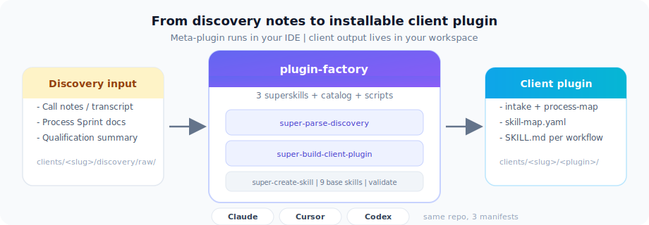
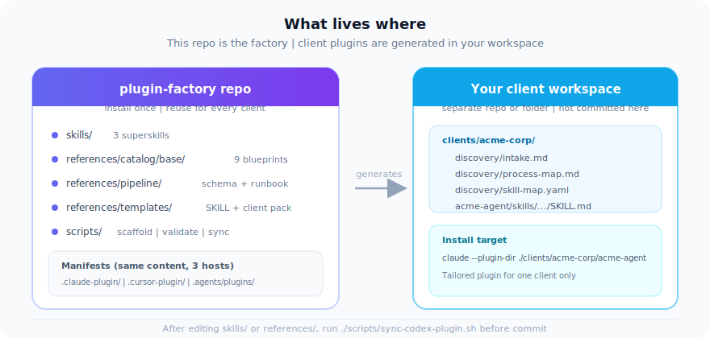
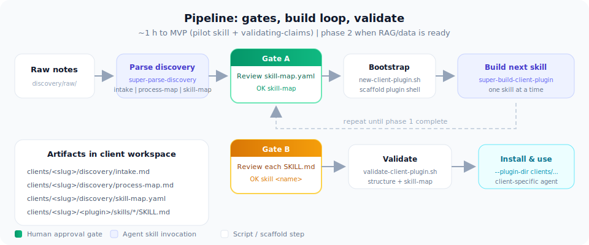

# plugin-factory

> Version 0.0.1

Drop in any client information. Get a ready-to-install Claude plugin.

**Client output** (`clients/<slug>/...`) is created in **your workspace**, not in this repo.

<p align="center">
  
</p>

## Install

Repo: `https://github.com/felipebasurto/plugin-factory`

### Claude Code — via marketplace (recommended)

Add the marketplace once, then install:

```shell
/plugin marketplace add felipebasurto/plugin-factory
/plugin install plugin-factory@plugin-factory
```

Claude Code will pull directly from GitHub. Updates via `/plugin marketplace update`.

**Development / one-session use:** clone and load with `--plugin-dir`:

```bash
git clone https://github.com/felipebasurto/plugin-factory.git
claude --plugin-dir ./plugin-factory
```

Reload without restarting: `/reload-plugins`

### Cursor (Claude-compatible layout at repo root)

```bash
git clone https://github.com/felipebasurto/plugin-factory.git
cp -r plugin-factory ~/.cursor/plugins/local/plugin-factory
```

Reload plugins → `@plugin-factory` or `/plugin-factory:super-parse-discovery`

### Codex (marketplace from GitHub)

The Codex marketplace catalog lives under `.agents/plugins/` and uses `git-subdir` to pull from GitHub automatically. Add it via CLI:

```bash
codex plugin marketplace add felipebasurto/plugin-factory --ref main --sparse .agents/plugins
```

Or in the Codex **Add marketplace** UI:

| Field | Value |
| ----- | ----- |
| Source | `felipebasurto/plugin-factory` |
| Git ref | `main` |
| Sparse paths | `.agents/plugins` |

Then install: marketplace **plugin-factory** → install **plugin-factory**.

To update:

```bash
codex plugin marketplace upgrade plugin-factory
```

Repo is **public**; no auth required. For background auto-updates from private forks set `GITHUB_TOKEN` in your shell environment.

## Skills

Start with `super-parse-discovery` — it is the single entry point. The other superskills are pipeline steps invoked automatically or manually as the build progresses.

| Skill | Invocation | Role |
| ----- | ---------- | ---- |
| `super-parse-discovery` | `/plugin-factory:super-parse-discovery` | **Entry point.** Takes any client information → intake, process-map, skill-map ready for Gate A |
| `super-build-client-plugin` | `/plugin-factory:super-build-client-plugin` | Pipeline step. Builds the client plugin from an approved skill-map (Gate B per skill) |
| `super-create-skill` | `/plugin-factory:super-create-skill` | Pipeline step. Authors a single skill or one-off plugin from templates |

**Catalog base skills** (`references/catalog/base/`) are reusable skill blueprints — not installed directly. Add them to the client `skill-map.yaml`, then build with `super-build-client-plugin`.

Shell helpers are documented in the runbook; they are not separate command files.

## Repo layout

<p align="center">
  
</p>

```text
plugin-factory/                 # Claude + Cursor: use this folder as plugin-dir
├── .claude-plugin/             # Claude Code manifest
├── .cursor-plugin/             # Cursor manifest
├── skills/                     # 3 superskills
├── references/
│   ├── best-practices/         # Authoring standards 01–12
│   ├── catalog/base/           # 9 reusable base skills
│   ├── pipeline/               # skill-map schema, runbook, inputs
│   ├── templates/              # SKILL.md template, client-pack, plugin stubs
│   ├── adapters/               # to-codex, to-cursor, to-openwork
│   └── delivery/               # discovery-intake template
├── scripts/                    # scaffold, validate, sync, orchestrate
├── clients/_template/          # notes on client output location
└── .agents/plugins/
    ├── marketplace.json        # Codex marketplace catalog
    └── plugin-factory/         # Codex install target (synced copy)
        └── .codex-plugin/
```

After editing root `skills/` or `references/`, run `./scripts/sync-codex-plugin.sh` before committing so the Codex package under `.agents/plugins/plugin-factory/` stays in sync. The Codex marketplace now uses `source: git-subdir` pointing to GitHub, so Codex users always get the latest committed state automatically — no local path required.

## Fast path (~1 h to usable client plugin)

1. Drop in client context: `/plugin-factory:super-parse-discovery`
2. Gate A: review `skill-map.yaml` → reply `OK skill-map`
3. Bootstrap from client workspace:
   ```bash
   ./scripts/new-client-plugin.sh --client-slug <slug> --plugin-name <name> --approve-gate-a
   ```
4. Build one skill at a time: `/plugin-factory:super-build-client-plugin`
   - Respects `build.mode: phase_1` — pilot skill + `validating-claims` first.
   - Gate B: review each `SKILL.md` → reply `OK skill <name>`.
5. Validate:
   ```bash
   ./scripts/validate-client-plugin.sh --client-slug <slug> --plugin-name <name>
   ```

See [references/pipeline/runbook.md](references/pipeline/runbook.md).

## Scripts

| Script | Purpose |
| ------ | ------- |
| `scripts/new-client-plugin.sh` | Scaffold + optional Gate A YAML patch + next-step prompts |
| `scripts/scaffold-client-plugin.sh` | Empty client plugin tree only |
| `scripts/validate-client-plugin.sh` | Check skill-map + plugin directory structure |
| `scripts/sync-codex-plugin.sh` | Refresh Codex package under `.agents/plugins/` |

## Base skill catalog

Nine ready-to-adapt skills in `references/catalog/base/`:

| Skill | Risk | Notes |
| ----- | ---- | ----- |
| `answering-rfps` | medium | |
| `documenting-design-system` | low | Includes tests and templates |
| `drafting-technical-quotes` | medium | |
| `drafting-weekly-reports` | low | |
| `searching-documentation` | low | |
| `summarizing-discovery-calls` | low | |
| `summarizing-support-tickets` | low | |
| `validating-claims` | high | Required for any customer-facing output; full test suite included |
| `writing-followups` | low | |

## Full workflow

<p align="center">
  
</p>

1. Open a **client workspace** (separate repo or folder with `clients/`).
2. Run `/plugin-factory:super-parse-discovery` with any client information and a `client_slug`. Outputs `intake.md`, `process-map.md`, `skill-map.yaml` under `clients/<slug>/discovery/`.
3. Review `skill-map.yaml` → reply **OK skill-map** (Gate A). Or run `new-client-plugin.sh --approve-gate-a` to patch the YAML and scaffold in one step.
4. Run `/plugin-factory:super-build-client-plugin`. It auto-scaffolds the plugin shell if missing, then builds one skill at a time.
5. Review each `SKILL.md` → reply **OK skill \<name\>** (Gate B). Batch available for up to 3 low-risk base skills after pilot is approved.
6. Repeat step 4–5 until all phase 1 skills are approved.
7. Validate and install:
   ```bash
   ./scripts/validate-client-plugin.sh --client-slug <slug> --plugin-name <name>
   claude --plugin-dir ./clients/<slug>/<plugin-name>
   ```
